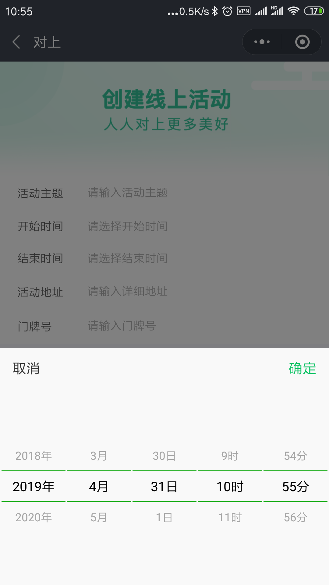

# mini-program-datetimepicker
因为工作需要，开发了一个 小程序的日期时间选择组件。 
A component for datetimepicker in the mini-program.

一开始我想使用[dateTimePicker](https://github.com/shuangjie/dateTimePicker)，但是因为存在[问题](https://github.com/shuangjie/dateTimePicker/issues/1)，所以放弃了。

后来也尝试了[`wx_date_picker`](https://github.com/Huge-HD/wx_date_picker)，很可惜没有写成组件，页面其他内容也不够干净。所以也放弃了. 干脆自己写一个

# 功能特点
* 封装成组件，方便调用，接口简单
* 支持年份，月份变更时，日期自动变更

# 效果图




# 安装使用
直接把components文件夹下的datetimepicker复制到自己的项目即可,
[参考demo](./pages/index.wxml)
```
// page.json
{
    "usingComponents": {
        "datetimepicker": "../components/datetimepicker"
    }
}
// page.wxml
<datetimepicker config="{{config}}" on:bindchange="bindchange"></datetimepicker>
```

# 配置
```
config = {
    placeholder: "没有选择时间时的提示文字",
    "init_datetime": "2019-11-11T00:00:00",
}
```


# 代办事项
* [x] 选择月份和年份后，日期要自动变更
* [ ] 支持各种形式输出和显示格式
* [ ] 支持各种年份, 最大值最小值
